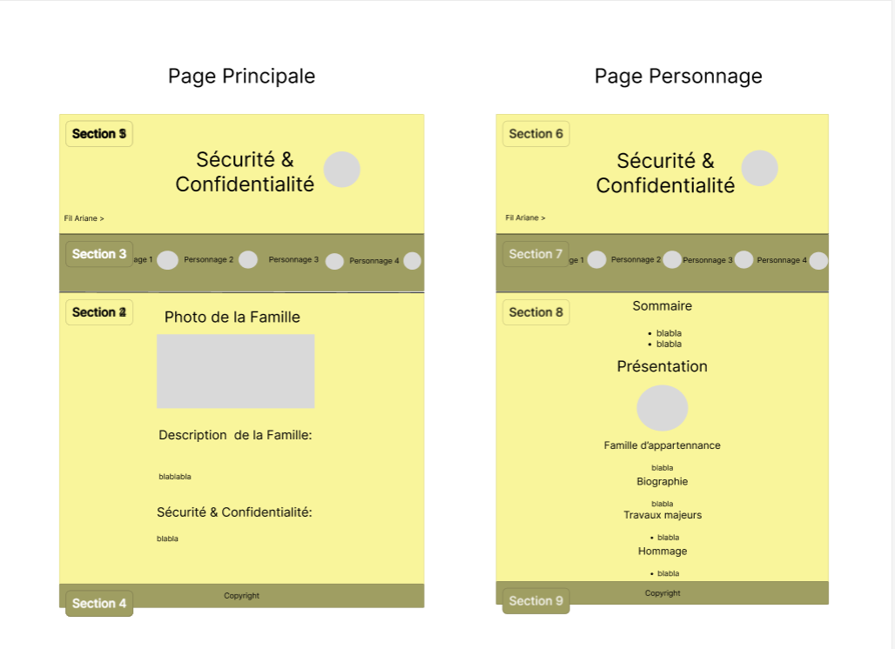

# Famille sécurité et confidentialité

Initiation en HTML/CSS : réalisation d'un site web qui présente un ensemble de personnes importantes ayant contribué ou contribuant encore au développement de l'informatique. Chaque personne appartient à une famille qui représente une thématique (un sous-domaine) de l'informatique :
  1. Algorithmes & programmation
  2. Mathématiques & informatique
  **3. Sécurité & confidentialité**
  4. Systèmes & réseaux
  5. Machines et composants
  6. Intelligence Artificielle
  7. Interaction Homme-Machine

Notre groupe de 4 personnes, c'est chargé de la famille sécurité et confidentialité

_Maquette_

